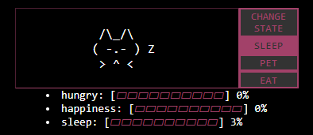

# Simple chrome extension tamagotchi-cat by topacai

This extension implements a tamagotchi in your browser that can be petted, fed, and played with.
It is showed on right corner of your browser when you click on it using popup chrome implementation.

## Features

Tamagotchi implements three stats for cat, `hunger`, `happiness` and `energy`. Their are automatically updated with different timers, you can use `Pet` and `Eat` buttons to recover `hunger` and `happiness` stats with their respectives cooldowns.

```
 /\_/\   /\_/\
( ^o^ ) ( o.O )
 > ^ <   > ^ <
```

- `Hunger` recover 33 points with each interaction, with 2.5 minutes cooldown
- `Happiness` recover 18 points with each interaction, with 1.5 minutes cooldown
- `Sleep` recover 100 points every 60 minutes while standing on sleeping state



Also, cat recover happiness and hunger with every page that ask to you to acceept cookies.

Cat also shows on your pages when it feels lonely, unhappy or hungry and want to play with you.

```
 /\_/\              /\_/\   WELCOME
( UwU ) ❤️          |^_^| > ☕ IDLE MODE
 > ^ <              /___\
```

### Implementations

#### Stats implementation

To handle stats an `chrome.alarm` is running every second as a `game loop` timer and it is used to update stats and cat states. (see `gameLoop.js` and `core.js` for more details)

All stats are managed using `chrome.storage` API and are saved when the browser is closed/opened. see `statsManager.js`

#### Cooldown implementation

`Eat` and `Pet` Actions has cooldown to avoid player spamming it and always keep the stats on top, cooldowns are managed with `chrome.alarms` in `cooldownManager.js`, these cooldowns are also saved using `chrome.storage` API and restored when the browser is closed/opened.

### Installation

To install this extension go to `chrome://extensions` and click on `LOAD UNPACKED` button, then select folder where `manifest.json` is.

> You have to allow `dev mode` on `chrome://extensions` page to install this extension

This extension also works on every browser that implements chrome extensions, like `Firefox`, `Opera` and `Edge`

---

> This extension is created only for fun as a gift to a friend, so it contains code that is not showed here for security reasons and the code is not very professional.
